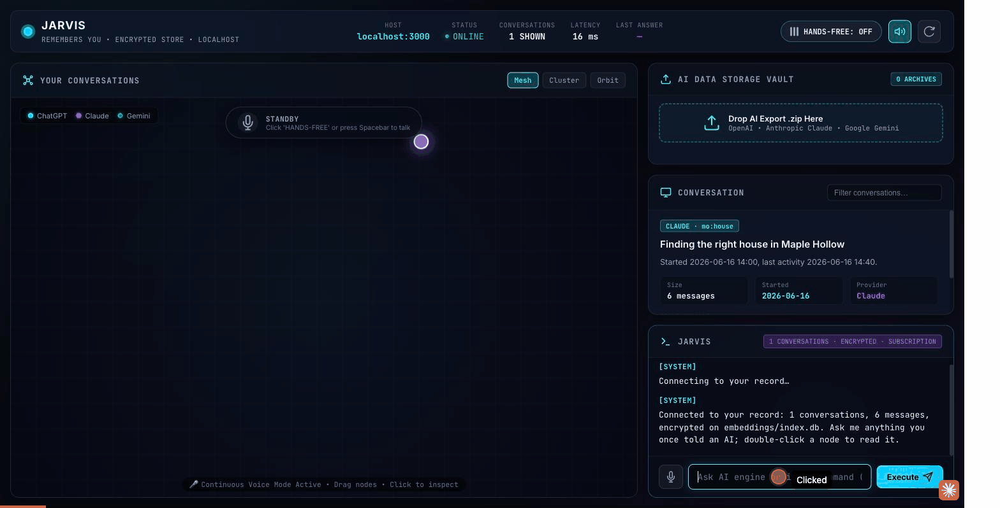

# ai-memory

**An assistant that remembers everything you've ever told any AI, running entirely off a drive in your pocket.**

Your conversation history with ChatGPT, Claude, and Gemini is legally yours and practically stranded
inside three vendor accounts. ai-memory is the on-ramp out: you hand it the export archive each
provider gives you, it lands every conversation — timestamps, thread boundaries, who said what — in
one SQLCipher-encrypted SQLite file, and a small assistant answers questions from that record, cites
the thread it drew from, and says "Not in your record." when it can't. You own the context and rent
the model. Read [CONSTRAINTS.md](CONSTRAINTS.md) first; it is the contract everything else obeys.

The same code, framed differently, is encrypted local retrieval over a private corpus — the shape
clinical and research work needs and cannot put in a cloud.

## The demo



The frame that matters is the middle one. Any assistant can answer when retrieval works. The one
above refuses instead of guessing the moment its record is gone — that's the difference between
memory and a model that hallucinates when the lookup fails, and it's the whole argument this
project is making. Recorded live against the real store, served straight off the encrypted SD card:

```
▸ What did I tell you about my commute to Flint?
[AI] Thirty-five minutes by car from Owosso to Flint, assessed as manageable [1]. That came up
     while house-hunting in Owosso, on the basis that you attend University of Michigan Flint
     and Mott [2].
Sources: [1] Finding the perfect house in Owosso · 2026-06-16 · [2] same thread

                              ── the drive comes out ──

▸ And what about the neighborhood I liked there?
[SYSTEM] Memory store went away (drive unplugged?). I can talk, but I cannot remember anything
         for you until it is back.
[AI] I couldn't say, sir — the memory store is offline at the moment, so I have nothing to draw
     on beyond what we've already discussed…

                              ── the drive goes back in ──

▸ And what about the neighborhood I liked there?
[AI] The record is back, sir — my apologies. The neighborhood in question is Ardelean, on the
     north side of Owosso: the city's most desirable area with the best resale floor, and the
     first one to call about [2][4]. Nothing in the record about a neighborhood in Flint itself.
```

No retry logic papered over that gap. No fallback to what the model would guess. It didn't know,
and it said so — because the only thing standing between "here's your answer" and "not in your
record" is whether the chip is in the drive.

Run it yourself:

```sh
bun scripts/serve.ts --key-file ~/.config/ai-memory/key     # the store, loopback only
bun scripts/ask.ts "What did I decide about the house?"      # answer + cited sources, or "Not in your record."
```

Then pull the drive mid-conversation. The assistant keeps talking and stops remembering:
"memory store offline". Plug it back in and the record returns. That gesture is the whole thesis.

## What is hard here

- **Three export formats, one schema.** ChatGPT exports a message *tree* (edits and regenerations
  are sibling branches; the current path is a pointer); Claude exports a list with typed content
  parts, thinking blocks, tool calls, and attachment text; Gemini Takeout is a flat activity log with
  no thread ids at all. The ingester preserves branches (`on_main_path`), marks what it did not keep
  verbatim, and infers Gemini threads by time gap while flagging every one as inferred. A synthetic
  fixture per provider pins the behaviour.
- **Encryption that survives you.** SQLCipher over a 2.4 GB FTS5 index; migration is count-verified
  before the plaintext is removed; cipher parameters live in a plaintext sidecar so a future default
  change can never lock the file; no escrow, no recovery key — losing the passphrase loses the store,
  and the contract says so.
- **A copy you can trust.** `push` allowlists what reaches media, scans the copy for anything
  secret-looking, then reopens the index *on the drive* with the key and counts rows before it says
  "verified". `--pull` holds the reverse direction to the same rule. A cross-vendor audit found the
  original blocklist would have carried `.env` onto the chip; the fix ships with a regression test.
- **An informed no.** `ask` retrieves through one search path (FTS5, stopwords dropped, optional
  keyword expansion), sends only the question and the top-k snippets, and the prompt forbids outside
  knowledge. The answer cites `[n]`; the CLI prints the thread title and date for every citation.

Zero dependencies: bun, `bun:sqlite`, and a SQLCipher library on the machine that opens the store.
The only outbound network code is one file, off unless you configure a provider.

## init (once per machine)

```sh
brew install sqlcipher            # macOS   (Debian/Ubuntu: apt install libsqlcipher0)
# store passphrase — pick one, keep it out of the repo:
export AI_MEMORY_KEY='a long passphrase you will not forget'   # or ~/.config/ai-memory/key (mode 600), or --key-file
```

The model behind `ask` is the signed-in `claude` CLI on your own subscription by default. To use
the Messages API instead, set `AI_MEMORY_PROVIDER=api` and put `ANTHROPIC_API_KEY` in a gitignored
`.env`. Neither secret is ever written by these scripts.

## commands

| command | what it does |
|---|---|
| `bun scripts/ingest.ts <export.zip\|dir\|file> [--provider chatgpt\|claude\|gemini] [--dry] [--include-thinking] [--gap-minutes 30]` | Parse a provider export into the store. Auto-detects the provider; skips account-identity files. |
| `bun scripts/ask.ts "question" [--k 8] [--dry] [--no-expand] [--source conv\|files\|all]` | Answer from your own record with cited sources, or "Not in your record." `--dry` shows what would be sent and sends nothing. |
| `bun scripts/query.ts "phrase" [--limit 5] [--source all\|conv\|files]` | Raw full-text search over conversations and collected files. |
| `bun scripts/collect.ts <dir...> [--max-mb 5] [--dry]` | Sweep local folders (notes, code) into the same store. |
| `bun scripts/encrypt.ts migrate\|rekey\|check [--dry]` | Migrate a plaintext index to SQLCipher, change the passphrase, or report the state. |
| `bun scripts/forget.ts <conversation-id> \| --provider X [--dry]` | Delete conversations and their search entries together. |
| `bun scripts/status.ts` | Encryption state, row counts, recorded pushes. |
| `bun scripts/push.ts /Volumes/CHIP [--dry] [--pull]` | Copy the store to media and verify it there. Refuses plaintext; never carries secrets. |
| `bun scripts/serve.ts [--port 3131]` | Loopback display and read-only JSON API over the store (`ui/`). |

`--dry` prints the plan and writes nothing. Every bulk or destructive command has it.

## getting your export

- **ChatGPT**: Settings → Data controls → Export data → zip with `conversations.json`.
- **Claude**: Settings → Privacy → Export data → zip with `conversations.json`.
- **Gemini**: takeout.google.com → only "My Activity" → Gemini Apps → format **JSON**.
  Takeout has no thread ids; threads are inferred by time gap and flagged `thread_inferred`.

## layout

```
CONSTRAINTS.md        the contract
scripts/              ingest, query, ask, collect, encrypt, forget, status, push, serve
scripts/lib/          openStore(), key handling, schema, parsers, ask (the one outbound file)
ui/                   the display served by serve.ts (canvas of conversations, search terminal)
tests/                bun test; fixtures/ holds one synthetic export per provider
docs/ON-THE-DRIVE.md  ships with every push; says what is on the media and what cannot open it
docs/*.gif             the chip-in / chip-out demo recording
embeddings/index.db   the store (SQLCipher) — the corpus lives here
corpus/               your plaintext inbox; never written by the system, never pushed
manifest.json         stats and verified pushes; no secrets
ISA.md                the system of record for how this was built and verified
```

## tests

```sh
bun test        # 70 tests: parsers, crypto migration, push/pull, ask (model endpoint mocked), audit regressions
```
